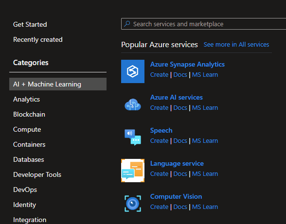
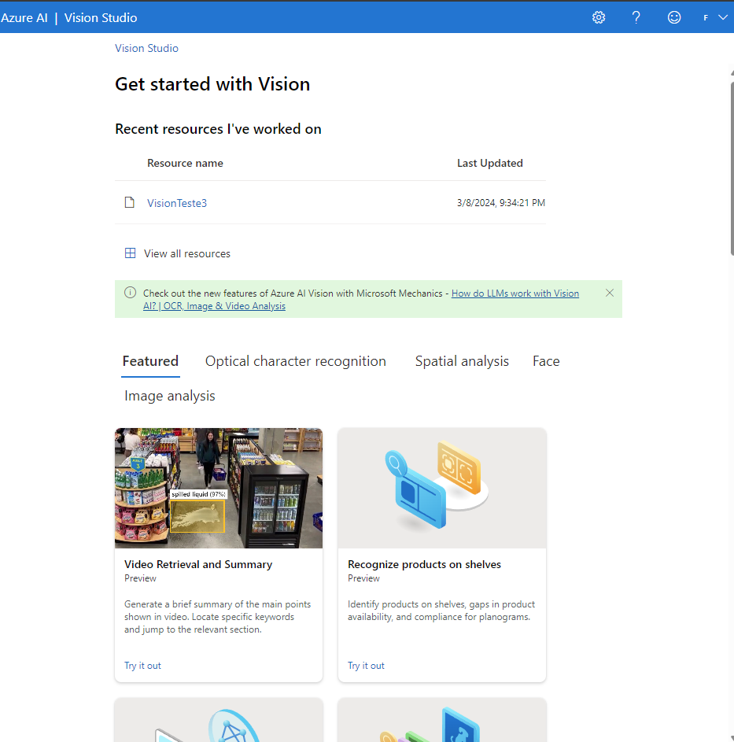
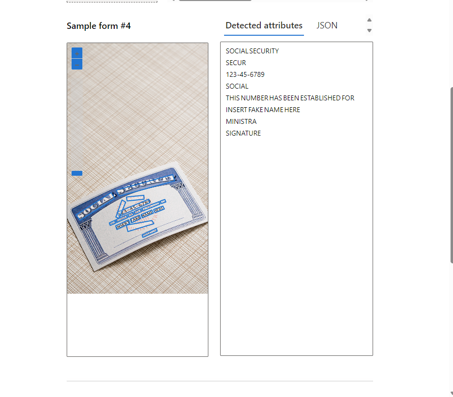

# dio-azure-text-ai

Passos:

1. Vincular sua conta do Azure ao Portal Vision

2. Entrar na página do Portal Vision

3. Selecionar a ferramenta de extração de texto de imagens

4. Fazer upload de alguma imagem e analisar o resultado

